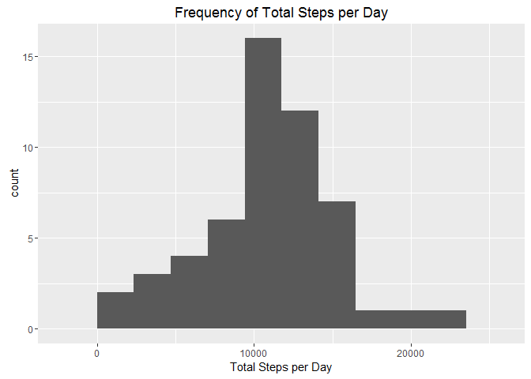
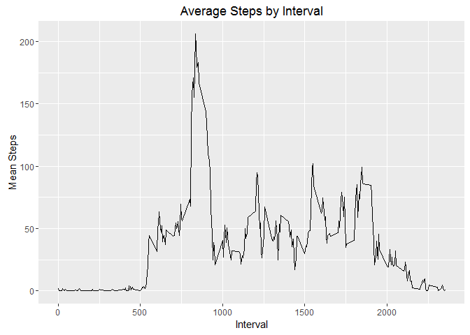
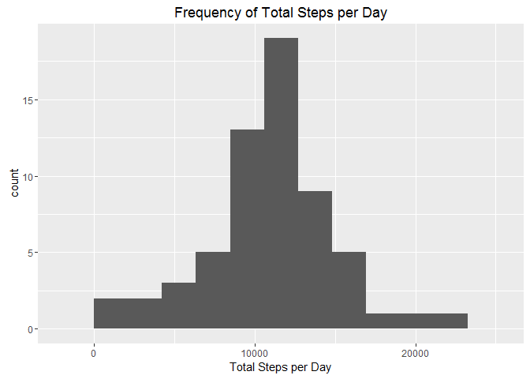
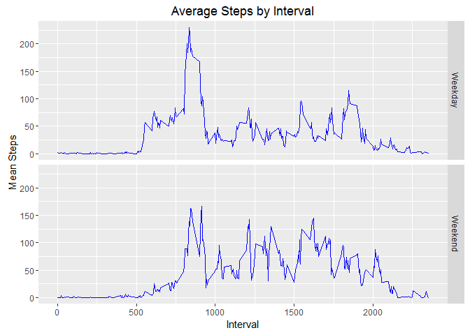

Reproducible Data Project 1
===========================


## Loading and preprocessing the data

To begin, we load the data that we will be working with.  We will also transform the values in the date column from factors into Dates, which we will need later.


```r
unzip("activity.zip")
data <- read.csv("activity.csv")
data$date <- as.Date(data$date)
```

At this time, we will also load the packages dplyr, tidyr, and ggplot2:


```r
require(dplyr)
```

```
## Loading required package: dplyr
```

```
## 
## Attaching package: 'dplyr'
```

```
## The following objects are masked from 'package:stats':
## 
##     filter, lag
```

```
## The following objects are masked from 'package:base':
## 
##     intersect, setdiff, setequal, union
```

```r
require(tidyr)
```

```
## Loading required package: tidyr
```

```r
require(ggplot2)
```

```
## Loading required package: ggplot2
```

Let's also take a quick look at the data, to get a feel for what it includes:


```r
head(data)
```

```
##   steps       date interval
## 1    NA 2012-10-01        0
## 2    NA 2012-10-01        5
## 3    NA 2012-10-01       10
## 4    NA 2012-10-01       15
## 5    NA 2012-10-01       20
## 6    NA 2012-10-01       25
```

## What is mean total number of steps taken per day?

Since our data contains missing values and we can ignore them, we will need to process our data to omit these entries.  At the same time, using dplyr and tidyr, we will calculate the total number of steps taken each day:


```r
q1data <- data %>%
        na.omit %>%
        group_by(date) %>%
        summarize(total_steps = sum(steps))
```

Let's take a peek:


```r
head(q1data, n = 4L)
```

```
## Source: local data frame [4 x 2]
## 
##         date total_steps
##       (date)       (int)
## 1 2012-10-02         126
## 2 2012-10-03       11352
## 3 2012-10-04       12116
## 4 2012-10-05       13294
```

As you can see, the data is grouped by date and the mean number of steps per date was calculated.

Here is a histogram of the total number of steps per day:


```r
q1_hist <- ggplot(q1data, aes(x = total_steps)) +
              geom_histogram(bins = 9) +
              labs(title = "Frequency of Total Steps per Day", x = "Total Steps per Day")
print(q1_hist)
```



Now, to determine the mean and median values of our data:


```r
mean(q1data$total_steps)
```

```
## [1] 10766.19
```

```r
median(q1data$total_steps)
```

```
## [1] 10765
```

## What is the average daily activity pattern?

Next, we want to see the average number of steps per interval.  Again, we will be ignoring any missing values:


```r
q2data <- data %>%
        na.omit %>%
        group_by(interval) %>%
        summarize(mean_steps = mean(steps))
```

And take a peek:


```r
head(q2data, n = 4L)
```

```
## Source: local data frame [4 x 2]
## 
##   interval mean_steps
##      (int)      (dbl)
## 1        0  1.7169811
## 2        5  0.3396226
## 3       10  0.1320755
## 4       15  0.1509434
```

Now the data is grouped by interval and the mean number of steps per interval has been calculated.

Let's see a time series plot of this data:


```r
q2_line <- ggplot(q2data, aes(x = interval, y = mean_steps)) +
                geom_line() +
                labs(title = "Average Steps by Interval", x = "Interval", y = "Mean Steps")
print(q2_line)
```



We want to know at which interval was there the most activity (number of steps):


```r
sortq2 <- q2data[order(-q2data$mean_steps),]
sortq2[1,1:2]
```

```
## Source: local data frame [1 x 2]
## 
##   interval mean_steps
##      (int)      (dbl)
## 1      835   206.1698
```


## Imputing missing values

Up until now, we have been using data that omits any missing values. What would the results look like if we estimated the missing values and repeated our calculation? What values should be use?

First, let's see how many missing values we have:


```r
sum(is.na(data$steps))
```

```
## [1] 2304
```

We can get an idea of what the missing values could be by taking the data that do we have and averaging the number of steps per interval.  Then, we can replace the missing values with these averages. The missing values will be replaced with an estimate of that the activity level (number of steps) would have been if the tracker was recording.

To so this, we will use the mean steps that we calculated in question 2 ("q2data") and replace the missing values with the corresponding means.  To preserve the original data, we will assign it a different name:


```r
newdata <- data
newdata$steps[is.na(newdata$steps)] <- q2data$mean_steps[match(newdata$interval[is.na(newdata$steps)],q2data$interval)]
```

What does this data look like:


```r
head(newdata, n = 4L)
```

```
##       steps       date interval
## 1 1.7169811 2012-10-01        0
## 2 0.3396226 2012-10-01        5
## 3 0.1320755 2012-10-01       10
## 4 0.1509434 2012-10-01       15
```

Now that the data no longer has missing values, we can calculate the mean number of steps and take a look at a histogram:


```r
q3data <- newdata %>%
        group_by(date) %>%
        summarize(total_steps = sum(steps))


q3_hist <- ggplot(q3data, aes(x = total_steps)) +
        geom_histogram(bins = 10) +
        labs(title = "Frequency of Total Steps per Day", x = "Total Steps per Day")

print(q3_hist)
```



Let's also take a look at the mean of these values can compare it to the numbers we got before.  The first value is the mean taken from the data where the missing values have been omitted. The second value is the mean taking from the data with the replaced values:


```r
mean(q1data$total_steps)
```

```
## [1] 10766.19
```

```r
mean(q3data$total_steps)
```

```
## [1] 10766.19
```

And the same for the median:


```r
median(q1data$total_steps)
```

```
## [1] 10765
```

```r
median(q3data$total_steps)
```

```
## [1] 10766.19
```

It appears that replacing the missing values had no impact on the mean and only a slight impact on the median. We could, in theory, use the original data while omitting the missing values, but replacing the values gives us data that may be less biased in future calculations.

## Are there differences in activity patterns between weekdays and weekends?

Now let's see if there is a difference between the activity levels of the weekends vs the weekdays.  We will use the replaced value dataset ("newdata").

First, we have to determine what day each of the dates were.  Then we can assign them as either a "weekday" or a "weekend". Finally, we will organize the data and find the mean steps per interval for each type of day.  With the magic of dpylr, we can do this in one chunck:


```r
q4data <- newdata %>%
                mutate(day = weekdays(date)) %>%
                mutate(day = ifelse(day == "Saturday" | day == "Sunday", "Weekend", "Weekday")) %>%
                group_by(day,interval) %>%
                summarize(mean_steps = mean(steps))
```

That's a lot of things to do at once, so lets take a peek at what the final data looks like:


```r
head(q4data, n = 4L)
```

```
## Source: local data frame [4 x 3]
## Groups: day [1]
## 
##       day interval mean_steps
##     (chr)    (int)      (dbl)
## 1 Weekday        0  2.2511530
## 2 Weekday        5  0.4452830
## 3 Weekday       10  0.1731656
## 4 Weekday       15  0.1979036
```

```r
tail(q4data, n = 4L)
```

```
## Source: local data frame [4 x 3]
## Groups: day [1]
## 
##       day interval mean_steps
##     (chr)    (int)      (dbl)
## 1 Weekend     2340 6.28773585
## 2 Weekend     2345 1.70518868
## 3 Weekend     2350 0.02830189
## 4 Weekend     2355 0.13443396
```

Now our data is grouped by day type ("weekend" or "weekday"), and the mean steps of the intervals have been calculated.  Let's take a look at a time series plot of this data:


```r
q4_line <- ggplot(q4data, aes(x = interval, y = mean_steps)) +
        geom_line(color = "blue") +
        facet_grid(day ~.) +
        labs(title = "Average Steps by Interval", x = "Interval", y = "Mean Steps")
print(q4_line)
```



As we can see, during the week, there is a spike of activity (the person probably does excersises during this time) followed by a generally low amount of activity.  They probably have a desk job.  On the weekends, there is generally more activity thoughout the course of the day.
